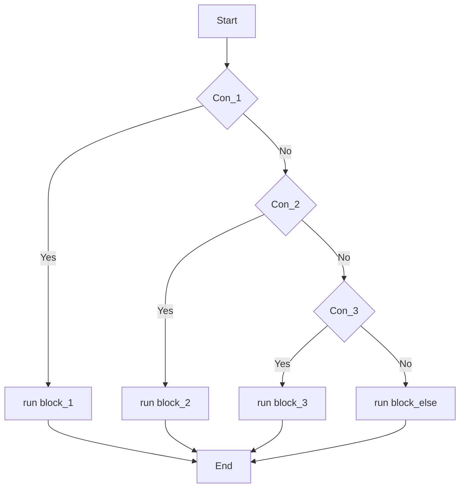
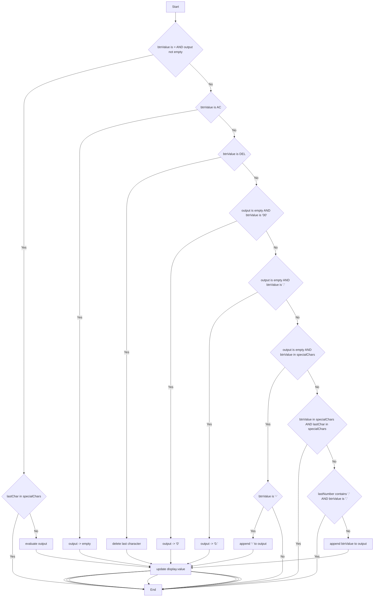

# Sơ đồ Validation 
## Cấu trúc điều kiện If - Else If - Else
### Code mẫu
```js
    if (điều_kiện_1) {
        // chạy khi điều_kiện_1 đúng
        block_1();
    } else if (điều_kiện_2) {
        // chạy khi điều_kiện_1 sai, và điều_kiện_2 đúng
        block_2();
    } else if (điều_kiện_3) {
        // chạy khi điều_kiện_1, điều_kiện_2 sai, và  điều_kiện_3 đúng
        block_3();
    } else {
        // chạy khi TẤT CẢ điều kiện trên đều sai
        block_else();
    }
```
### Sơ đồ mermaid


## Validation Diagram

### Code 01 - JS
```js
const display = document.querySelector(".display");
const buttons = document.querySelectorAll("button");
const specialChars = ["%", "*", "/", "-", "+", "="];
let output = "";


buttons.forEach((button) => {
    button.addEventListener("click", (e) => calculate(e.target.dataset.value));
});

const calculate = (btnValue) => {
    const lastChar = output.toString().slice(-1);
    const lastNumber = output.toString().split(/[\+\-\*\/\%]/).pop();
    display.focus();
    // Nếu btnValue là "=" và output không rỗng
    if (btnValue === "=" && output !== "") {
        if (specialChars.includes(lastChar)) {
            return; // Không tính nếu chuỗi kết thúc bằng toán tử
        }
        // Nếu output có '%', thay thế bằng '/100' trước, sau đó thực thi chuỗi.
        output = eval(output.replace("%", "/100"));
    } else if (btnValue === "AC") {
        output = "";
    } else if (btnValue === "DEL") {
        // Nếu nút DEL được nhấn, xóa ký tự cuối cùng khỏi output.
        output = output.toString().slice(0, -1);
    } else {
        // V-04: Xử lý 00 ở đầu chuỗi
        if (output === "" && btnValue === "00") {
            output = "0";
        }
        // V-07: Xử lý dấu thập phân
        else if (output === "" && btnValue === ".") {
            output = "0."; // Tự động thêm 0 trước dấu chấm (V-07)
        }
        // V-10 & V-11: Xử lý toán tử ở đầu chuỗi
        else if (output === "" && specialChars.includes(btnValue)) {
            if (btnValue === "-") {
                output += btnValue;  // Cho phép dấu âm (V-11)
            } else {
                return; // Chặn * hoặc / ở đầu (V-10)
            }
        }
        // V-09: Chặn 2 toán tử liên tiếp (BR-02) [2, 3]
        // Nếu phím bấm là toán tử VÀ ký tự cuối cùng cũng là toán tử
        else if (specialChars.includes(btnValue) && specialChars.includes(lastChar)) {
            return; // Không xử lý, giữ nguyên trạng thái (BR-11) [4]
        }
        // V-05, V-06: Xử lý dấu thập phân
        else if (lastNumber.includes(".") && btnValue === ".") {
            return; // Không xử lý nếu số hiện tại đã có dấu chấm
        }
        // Trường hợp thông thường: Cộng dồn giá trị vào chuỗi
        else {
            output += btnValue;
        }
    }
    display.value = output;
}
```
### Sơ đồ mermaid

