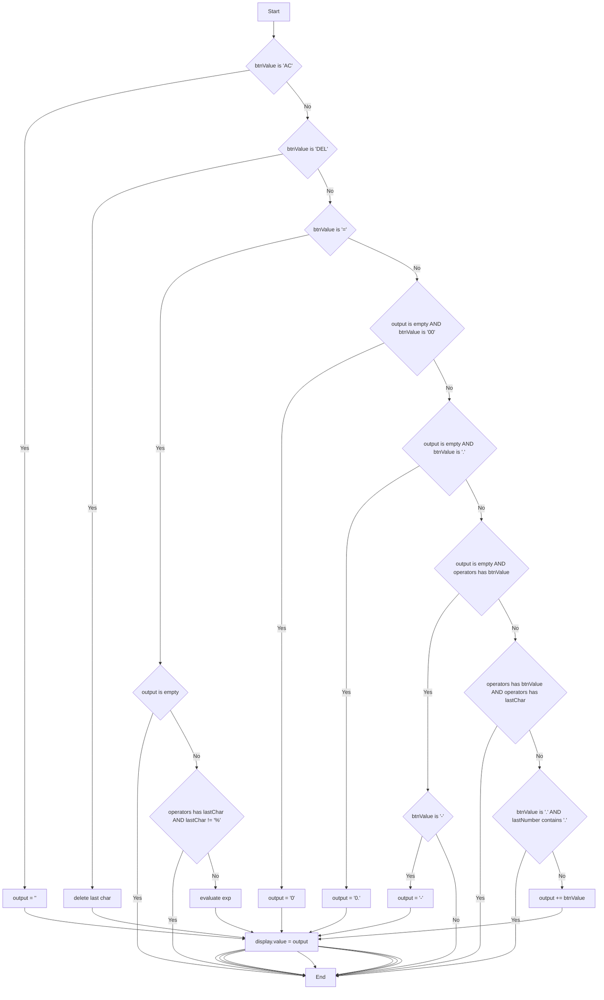

# Sơ đồ Validation 
```text
version: 1.1
status : Draft → To be Frozen
```

## 1. Code - js
```js
const display = document.querySelector(".display");
const buttons = document.querySelectorAll("button");

// Operators dùng trong biểu thức (không tính "=" vì "=" là hành động)
const operators = new Set(["%", "*", "/", "-", "+"]);
const splitByOperators = /[+\-*/%]/; // regex để tách phần số hiện tại

let output = "";

buttons.forEach((button) => {
    button.addEventListener("click", (e) => calculate(e.target.dataset.value));
});

function calculate(btnValue) {
    const str = String(output);
    const lastChar = str.slice(-1);
    const lastNumber = str.split(splitByOperators).pop(); // phần số hiện tại

    display.focus();

    // 1) Commands
    if (btnValue === "AC") {
        output = "";
        display.value = output;
        return;
    }

    if (btnValue === "DEL") {
        output = str.slice(0, -1);
        display.value = output;
        return;
    }

    // 2) Evaluate "="
    if (btnValue === "=") {
        if (output === "") return;
        if (operators.has(lastChar) && lastChar !== "%") return; // chặn kết thúc bằng toán tử

        // xử lý nhiều dấu %
        const expr = str.replaceAll("%", "/100");
        output = String(eval(expr)); // (giữ nguyên cách bạn đang làm)
        display.value = output;
        return;
    }

    // 3) Validation / build expression
    // V-04: '00' ở đầu
    if (output === "" && btnValue === "00") {
        output = "0";
        display.value = output;
        return;
    }

    // V-07: '.' ở đầu => '0.'
    if (output === "" && btnValue === ".") {
        output = "0.";
        display.value = output;
        return;
    }

    // V-10 & V-11: toán tử ở đầu
    if (output === "" && operators.has(btnValue)) {
        if (btnValue === "-") {
            output = "-"; // cho phép số âm
            display.value = output;
        }
        // chặn *, /, +, % ở đầu
        return;
    }

    // V-09: chặn 2 toán tử liên tiếp
    if (operators.has(btnValue) && operators.has(lastChar)) {
        return;
    }

    // V-05, V-06: chặn nhập '.' lần 2 trong cùng 1 số
    if (btnValue === "." && lastNumber.includes(".")) {
        return;
    }

    // Normal append
    output = str + btnValue;
    display.value = output;
}
```

## 2. Mermaid Diagram

## 3. 改訂履歴（Revision History）
| Version | Date       | Description          | Author   |
| ------- | ---------- | -------------------- | -------- |
| 1.0     | 2026-01-25 | Initial Release      | BrSE Dang   |
| 1.1     | 2026-01-27 | separate Commands, Evaluate and validation to improve clarity | BrSE Dang   |