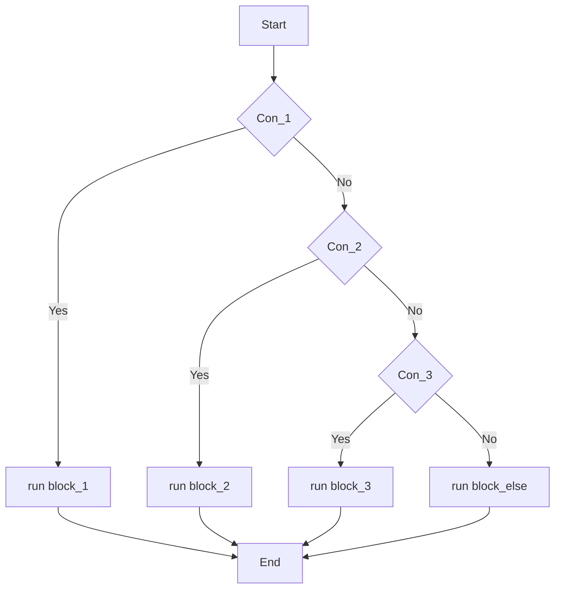
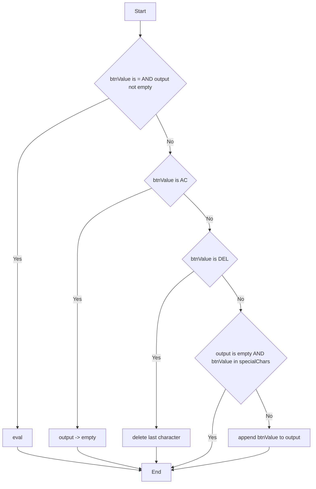

# Sơ đồ Validation 
## Cấu trúc điều kiện If - Else If - Else
### Code mẫu
```js
    if (điều_kiện_1) {
        // chạy khi điều_kiện_1 đúng
        block_1();
    } else if (điều_kiện_2) {
        // chạy khi điều_kiện_1 sai, và điều_kiện_2 đúng
        block_2();
    } else if (điều_kiện_3) {
        // chạy khi điều_kiện_1, điều_kiện_2 sai, và  điều_kiện_3 đúng
        block_3();
    } else {
        // chạy khi TẤT CẢ điều kiện trên đều sai
        block_else();
    }
```
### Sơ đồ mermaid


## Validation
### Code 
```js
const calculate = (btnValue) => {
    display.focus();
    // Nếu btnValue là "=" và output không rỗng
    if (btnValue === "=" && output !== "") {
        // Nếu output có '%', thay thế bằng '/100' trước, sau đó thực thi chuỗi.
        output = eval(output.replace("%", "/100"));
    } else if (btnValue === "AC") {
        output = "";
    } else if (btnValue === "DEL") {
        // Nếu nút DEL được nhấn, xóa ký tự cuối cùng khỏi output.
        output = output.toString().slice(0, -1);
    } else {
        // Nếu output rỗng và nút là specialChars thì thoát
        if (output === "" && specialChars.includes(btnValue)) return;
        output += btnValue;
    }
    display.value = output;
}
```

